# Projeto de interface

Pré-requisitos: <a href="03-Product-design.md"> product design</a>

 O sistema MenuFlash foi pensado para facilitar a vida de alunos, professores e funcionários da PUC que precisam pedir lanches de forma rápida e prática, sem enfrentar filas. As telas foram organizadas de maneira simples e intuitiva, baseadas nas histórias de usuário levantadas na etapa de Product Design.

A navegação começa pela escolha do campus e da lanchonete, passando pelo cardápio, carrinho e formas de pagamento. Também é possível favoritar produtos, repetir pedidos anteriores e visualizar o mapa com a localização das lanchonetes.

O layout foi feito para funcionar bem tanto no celular quanto no computador, atendendo aos requisitos de acessibilidade, responsividade e segurança. O protótipo das telas foi desenvolvido no Figma e conecta todas essas funcionalidades de forma clara.

 ## User flow

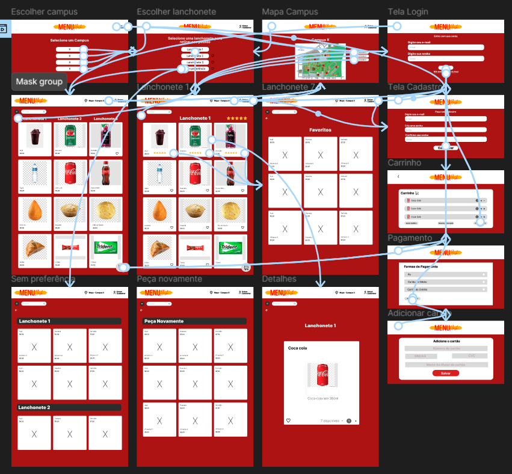

## Wireframes

##### TELA XPTO

**Selecionar Campus**

Tela inicial onde o usuário escolhe o campus desejado para visualizar as lanchonetes disponíveis.

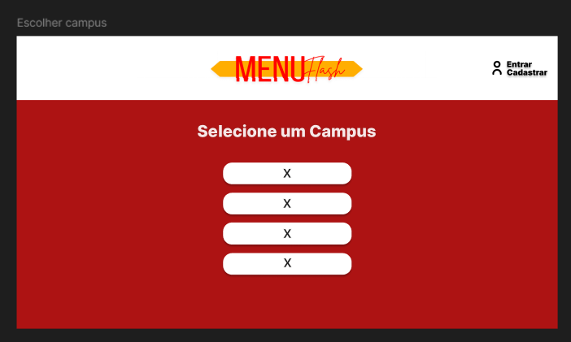

**Mapa do Campus e Lanchonetes**

Tela com o mapa interativo, indicando as localizações das lanchonetes dentro do campus e os botões de cada uma.

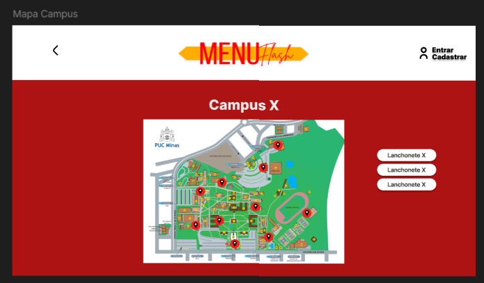

**Login**

Tela de autenticação para usuários já cadastrados acessarem sua conta.

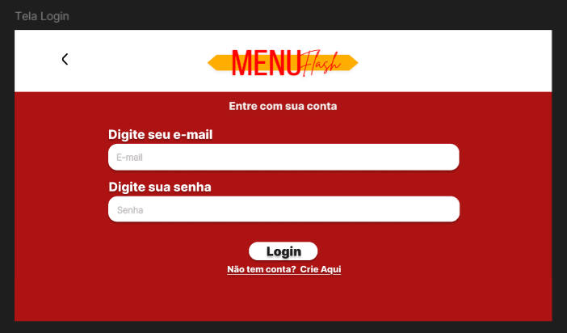

**Cadastro**

Tela onde novos usuários podem criar uma conta para utilizar o sistema.

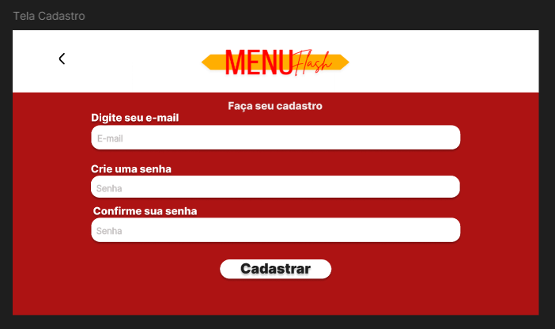

**Carrinho**

Tela que exibe os itens adicionados pelo usuário antes de finalizar o pedido.

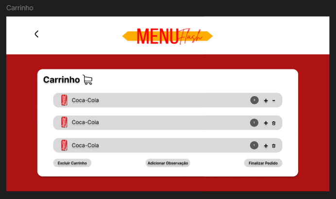

**Formas de Pagamento**

Tela onde o usuário escolhe a forma de pagamento para o pedido.

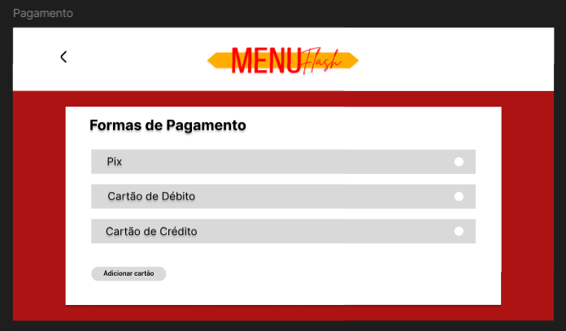

**Adicionar Cartão**

Formulário para adicionar dados de um novo cartão de crédito ou débito.

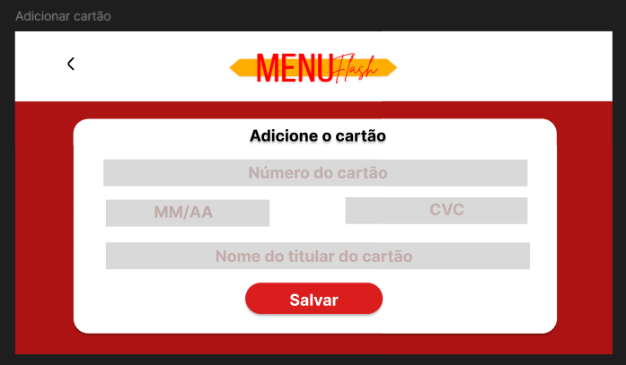
 
**Sem Preferência**

Mostra todas as lanchonetes daquele campus.

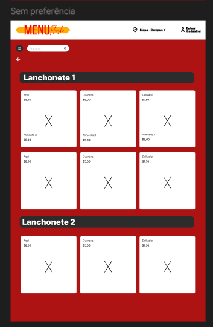

**Lanchonete (Cardápio)**

Tela com os produtos disponíveis na lanchonete selecionada, com opção de favoritar ou adicionar ao carrinho.

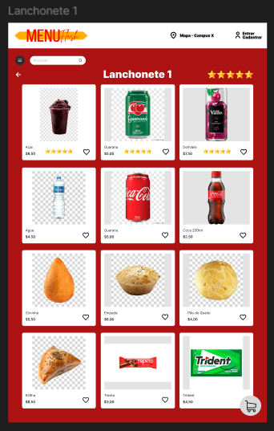

**Favoritos**

Tela onde o usuário pode visualizar os itens que marcou como favoritos.

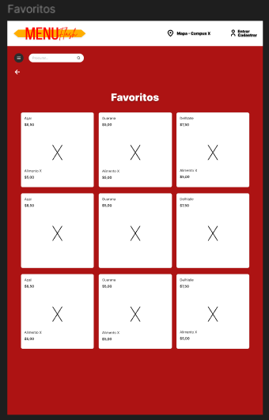

**Peça Novamente**

Tela com histórico de pedidos anteriores para facilitar a repetição de pedidos.

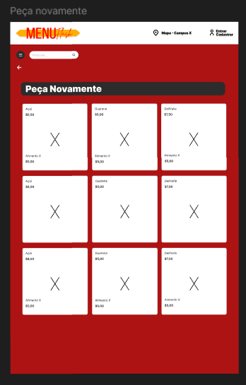

**Detalhes do Item**

Tela com informações detalhadas sobre um produto específico.

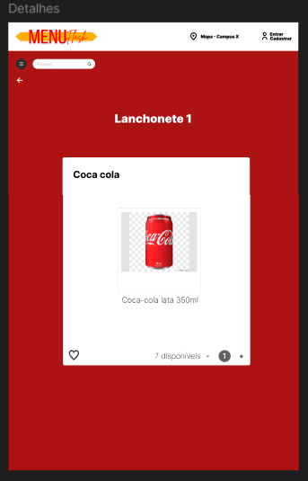

### Protótipo Interativo

| FIGMA: | https://www.figma.com/proto/T6MGgP9B9tfb1dWsLrRAKz/MenuFlash?node-id=185-973&t=NxjVziqK5TGU4SPw-1&scaling=min-zoom&content-scaling=fixed&page-id=0%3A1&starting-point-node-id=185%3A973 |