# Arquitetura da solução

<span style="color:red">Pré-requisitos: <a href="05-Projeto-interface.md"> Projeto de interface</a></span>

## Funcionalidades

##### Funcionalidade Obrigatória - Login e cadastro

Permite o cadastro e autenticação de usuários no sistema, diferenciando perfis padrão e administradores.

*Estrutura de dados:* usuarios] (#estrutura-de-dados---usuarios)[
*Instruções de acesso:*
* Acesse o site e clique em "Entrar" ou "Cadastrar";
* Preencha o formulário de login ou cadastro;

*Tela da funcionalidade:*


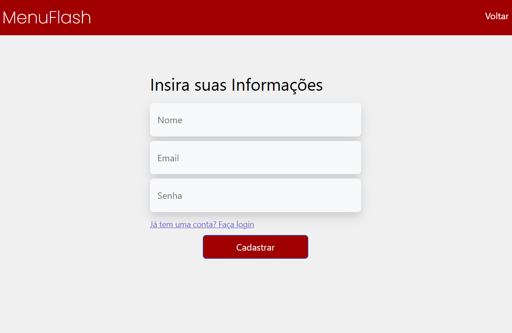

##### Funcionalidade 1 - Mostrar cardápio de cada lanchonete

Exibe os produtos disponíveis em cada lanchonete do campus selecionado.

*Estrutura de dados:* [lanchonetes]
*Instruções de acesso:*
* Na home, selecione um campus;
* Escolha uma lanchonete para visualizar os produtos.

*Tela da funcionalidade:*

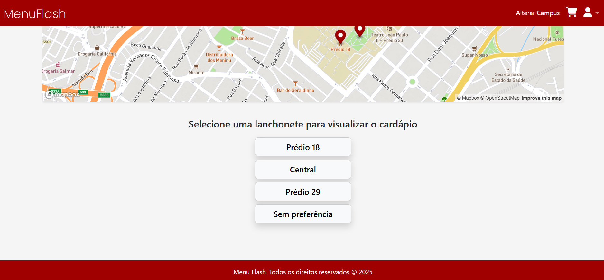
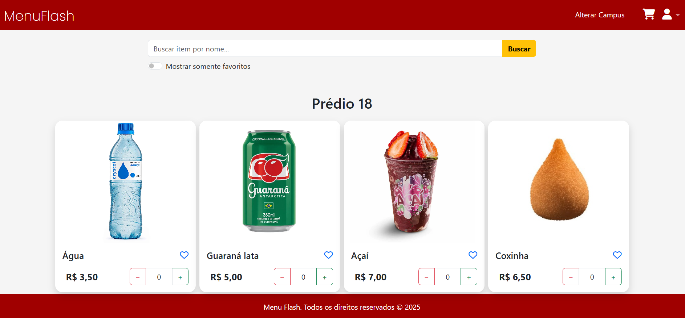

##### Funcionalidade 2 - Histórico de pedidos

Exibe os pedidos anteriores feitos pelo usuário logado, com data, hora, itens e valores.

*Estrutura de dados:* historico_de_pedidos dentro de usuarios
*Instruções de acesso:*
* Faça login;
* Acesse o menu, clique em perfil e depois em "Histórico de Pedidos".

*Tela da funcionalidade:*

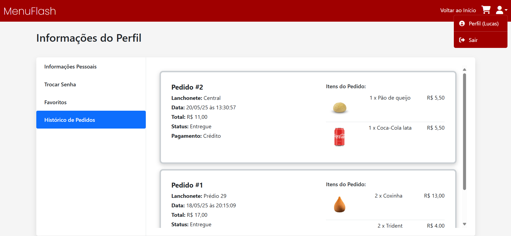

##### Funcionalidade 3 - Modal com imagem, legenda, descrição e preço do produto.

Exibe um modal ao clicar em um produto, mostrando detalhes como imagem, descrição, conteúdo e preço.

*Estrutura de dados:* lanchonetes.itens
*Instruções de acesso:*

* Clique sobre o card do produto desejado.

*Tela da funcionalidade:*

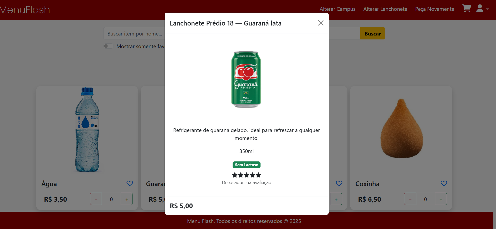

##### Funcionalidade 4 - Peça novamente

Página onde permite visualizar e repetir pedidos anteriores.

*Estrutura de dados:* historico_de_pedidos
*Instruções de acesso:*
* Faça login;
* Clique em "Peça novamente" para visualizar um pedido anterior ou repeti-lo.

*Tela da funcionalidade:*

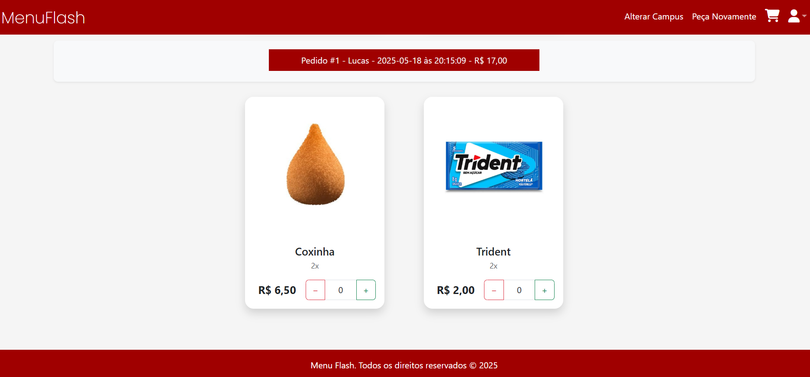

##### Funcionalidade 5 - Favoritos

Permite marcar/desmarcar itens como favoritos e acessar a lista de favoritos posteriormente.

*Estrutura de dados:* usuarios[].favoritos ou itens[].favoritos

*Instruções de acesso:*
* Clique no ícone de coração em um produto;
* Acesse a página "Favoritos" dentro do perfil para visualizar sua lista de favoritos.

*Tela da funcionalidade:*

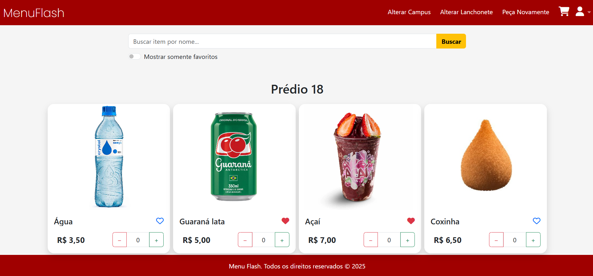
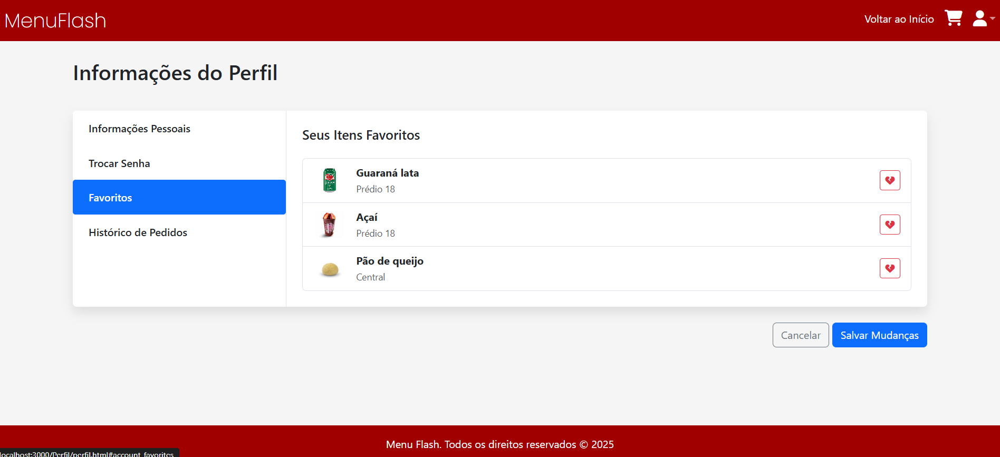

##### Funcionalidade 6 - Formas de pagamento (cartão/ pix)

Exibe e registra a forma de pagamento escolhida no momento da finalização do pedido.

*Estrutura de dados:* forma_pagamento em historico_de_pedidos
*Instruções de acesso:*
* Após adicionar produtos ao carrinho, clique em "Finalizar pedido" e escolha a forma de pagamento.

*Tela da funcionalidade:*

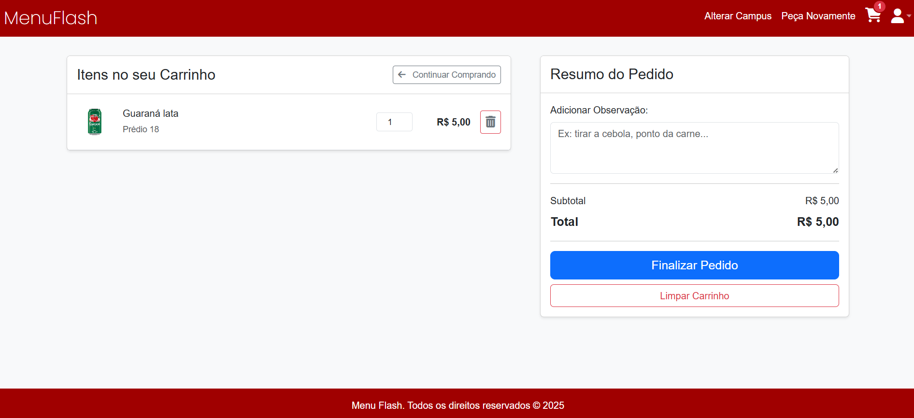
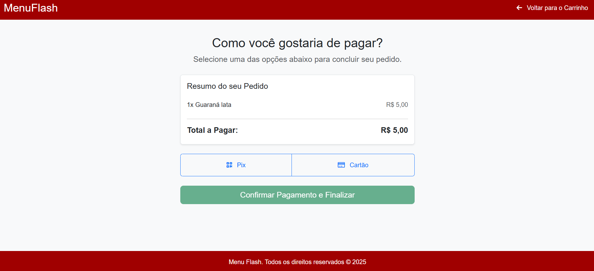

##### Funcionalidade 7 - Mapa do campus com indicação das lanchonetes

Exibe mapa interativo com os locais das lanchonetes nos campus.

*Estrutura de dados:* Foi utilizada uma API
*Instruções de acesso:*
* Na tela inicial, escolha o campus para visualizar seu respectivo mapa.

*Tela da funcionalidade:* 
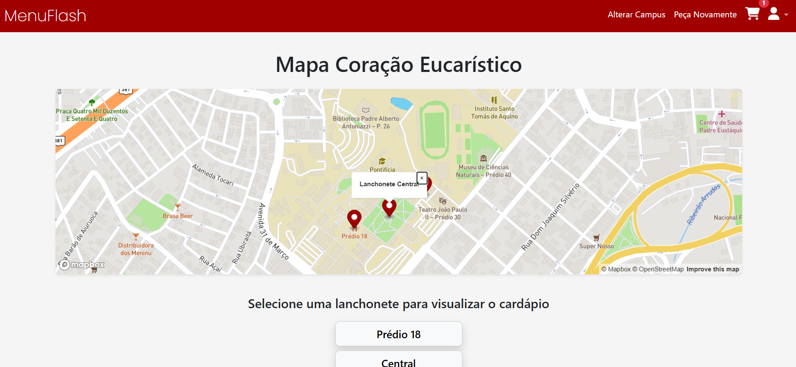

##### Funcionalidade 8 - Carrinho de pedidos

Armazena os itens que o usuário deseja comprar, com opções para alterar quantidade ou remover.

*Estrutura de dados:* carrinhos
*Instruções* de acesso:*
* Adicione* um item ao carrinho;
* Clique no ícone de carrinho no topo da página.

*Tela da funcionalidade:* 
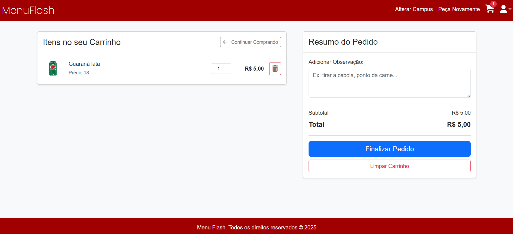

##### Funcionalidade 9 - Identificação de itens com restrição alimentar

Dentro do modal, exibe ícones indicando se o produto é sem lactose e/ou sem glúten.

*Estrutura de dados:* [Itens]
*Instruções de acesso:*
* Ao visualizar um cardápio ou modal de produto, verifique os ícones informativos.

*Tela da funcionalidade:* 
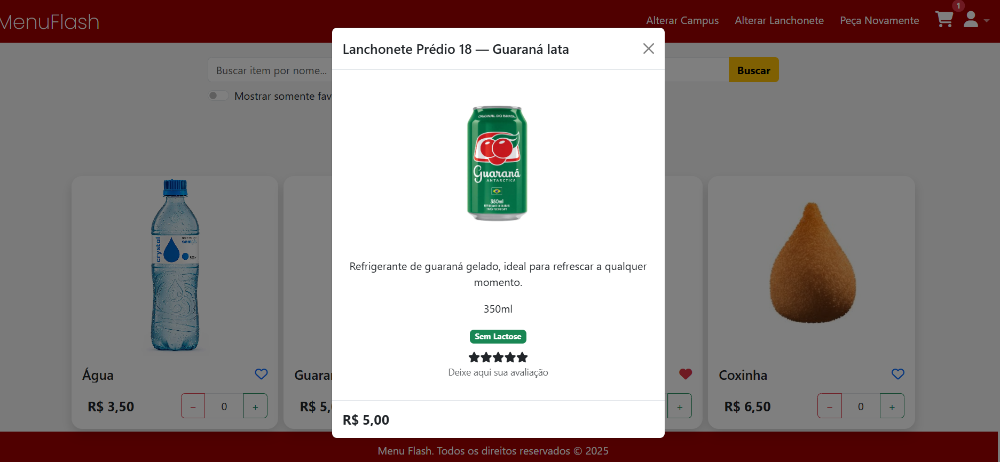

##### Funcionalidade 10 - Avaliação de itens

Permite que usuários atribuam notas aos produtos dentro do modal.

*Estrutura de dados:* local storage
*Instruções de acesso:*
* Ao acessar o modal de um produto, clique nas estrelas para avaliar.

*Tela da funcionalidade:* 


##### Funcionalidade 11 - Campo de pesquisa

Filtra os produtos disponíveis conforme o termo digitado pelo usuário.

*Estrutura de dados:* local storage
*Instruções de acesso:*
* Digite no campo de busca na tela de cardápio.

*Tela da funcionalidade:* 
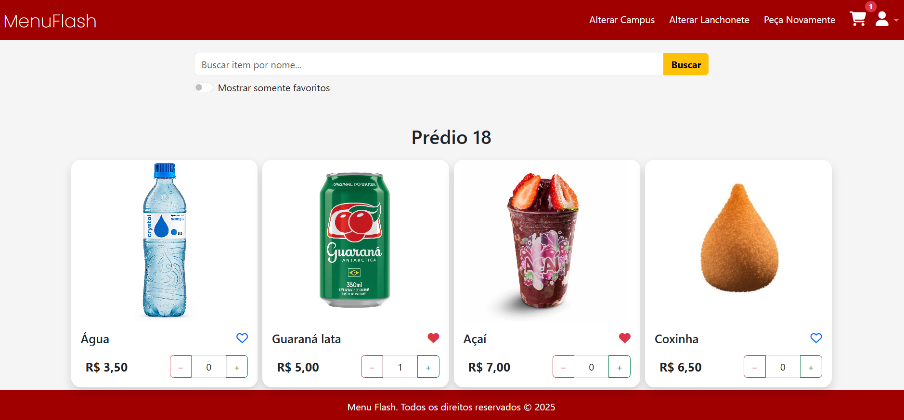

##### Funcionalidade 12 - Perfil do usuário

Mostra os dados do usuário logado, como nome, e-mail, favoritos, histórico de pedidos.

*Estrutura de dados:* usuarios
*Instruções de acesso:*
* Clique no ícone do perfil no menu superior.

*Tela da funcionalidade:* 
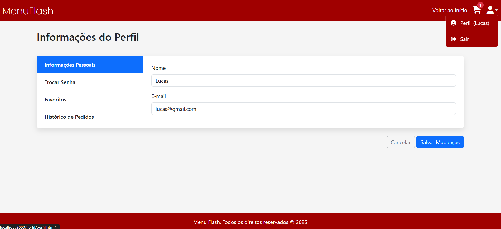

##### Funcionalidade 13 - Trocar senha do usuário

Permite que o usuário altere sua senha.

*Estrutura de dados:* [usuário]
*Instruções de acesso:*
* Acesse o perfil e clique em "Trocar Senha";
* Preencha os campos com a senha atual e a nova senha.

*Tela da funcionalidade:* 
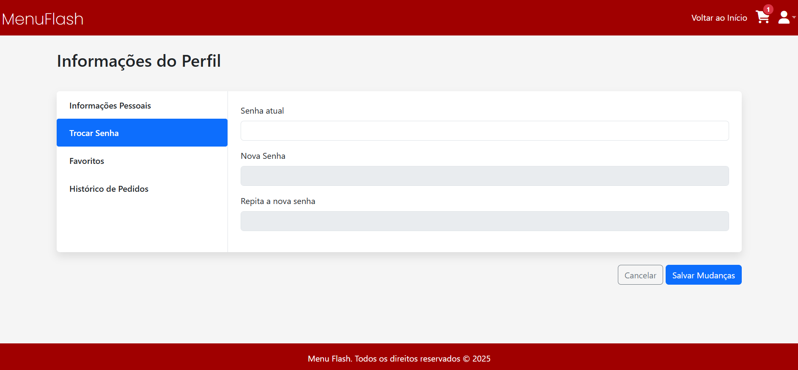


### Estruturas de dados

Descrição das estruturas de dados utilizadas na solução com exemplos no formato JSON.Info.

##### Estrutura de dados - Usuários

Registro dos usuários do sistema, utilizado para login e para o perfil do sistema.

```json
  {
    "id": "1",
    "nome": "Lucas",
    "email": "lucas@gmail.com",
    "senha": "123456"
  }
```

##### Estrutura de dados - Histórico de pedidos
usuarios[].historico_de_pedidos

Ao finalizar a compra, o pedido é salvo no histórico do usuário com detalhes.

```json
  {
    "pedido_id": "2",
    "data": "2025-05-20",
    "total": 11,
    "itens": [
      {
        "id": 5,
        "titulo": "Pão de queijo"
      }
    ]
  }
```

##### Estrutura de dados - Itens

```json
{
"id": 4,
"titulo": "Coxinha",
"descricao": "Coxinha de frango com massa crocante e recheio cremoso, um clássico brasileiro.",
"conteudo": "",
"disponivel": true,
"favorito": true,
"semLactose": false,
"semGluten": false,
"imagem": "../principal/img/itens/coxinha.png",
"quantidade": 2,
"preco_unitario": 6.5,
"subtotal": 13
}
```

##### Estrutura de dados - Lanchonetes

Mostra os itens disponíveis em uma lanchonete e suas informações, também permite ações como adicionar ao carrinho.

```json
  {
    "id": "2",
    "nome": "Central",
    "itens": [
      {
        "id": 7,
        "titulo": "Coca-Cola lata",
        "valor": 5.5,
        "disponivel": true
      }
    ]
  }
```

##### Estrutura de dados - Carrinho

Armazena os itens adicionados pelo usuário, permitindo ajustes de quantidade.

```json
  {
    "userId": "1",
    "itens": [
      {
        "id": 5,
        "quantidade": 1,
        "subtotal": 5.5
      }
    ]
  }
```

##### Estrutura de dados - Campus

O usuário pode selecionar um campus e visualizar as lanchonetes disponíveis nele.

```json
  {
    "nome": "PUC MINAS - Contagem",
    "mapa": "mapaContagem.html",
    "lanchonetes": [
      {
        "id": "4",
        "nome": "Lanchonete Praçaki"
      }
    ]
  }
```

### Módulos e APIs

Esta seção apresenta os módulos e APIs utilizados na solução.

**Fonts:**

Google API - [https://fonts.googleapis.com/css2?family=Poppins:wght@200;600&display=swap]

**Mapa:**

Mapa - [https://api.mapbox.com/mapbox-gl-js/v2.15.0/mapbox-gl.css]

**Scripts:**

* Bootstrap - [https://cdn.jsdelivr.net/npm/bootstrap@5.3.3/dist/css/bootstrap.min.css]


> O projeto utiliza principalmente módulos e APIs do próprio JavaScript para o frontend, como o fetch para realizar requisições HTTP. As chamadas de API são feitas para um servidor local e utilizar um backend simulado pedo db.json
API REST local: As requisições são feitas para endpoints como /carrinhos, /usuarios e /lanchonetes
Módulo fetch: Utilizado em diversos arquivos .js para consumir a API.

## Hospedagem

O site, conforme o projeto atual, foi pensada para rodar localmente, tanto o frontend quanto o backend simulado.

> **Links úteis**:
> - [Website com GitHub Pages](https://pages.github.com/)
> - [Programação colaborativa com Repl.it](https://repl.it/)
> - [Getting started with Heroku](https://devcenter.heroku.com/start)
> - [Publicando seu site no Heroku](http://pythonclub.com.br/publicando-seu-hello-world-no-heroku.html)
